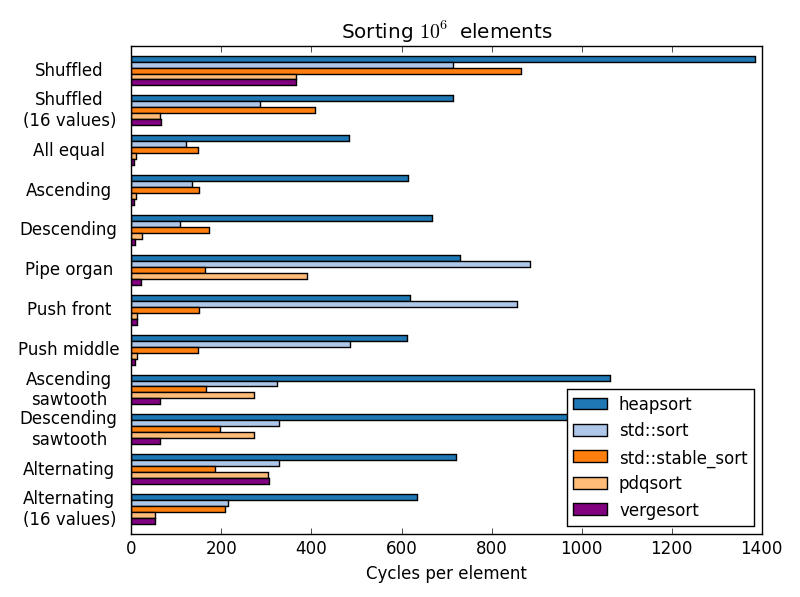
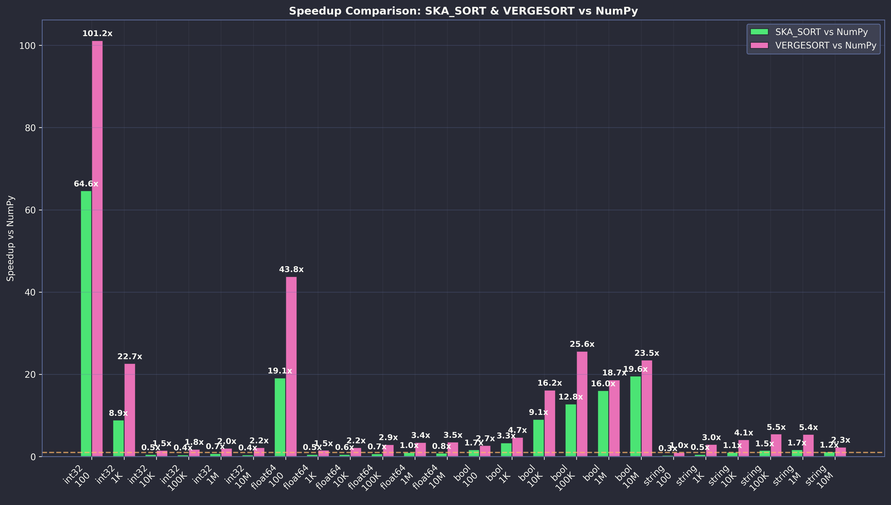

# Numpy vs Ska-sort & Vergesort

**Optimizando un índice invertido en Python usando bindings de C++.**

**Autor:** *Benjamín Enrique Parra Barbet*
**Fecha:** Junio 2025

---

## Introducción

Al momento de analizar asintóticamente los algoritmos, muchas veces la operación con más peso suele ser la de ordenar. Al utilizar un algoritmo basado en comparaciones, no se puede optar a nada mejor que O(n log n). Algoritmos no basados en comparaciones pueden ser una opción de optimización, pues está demostrado que pueden ordenar en O(n) operaciones, donde la constante suele ser más o menos grande entre más óptimo sea en memoria. Algunos ejemplos como counting sort (implementado con hashmaps) pueden mostrar buen performance independiente del caso en el que se encuentre, pero las operaciones adicionales (como cálculo de hash) pueden entorpecer al algoritmo lo suficiente como para no ser competitivo con otros. Por ello han surgido alternativas que tratan de mejorar esto, haciendo funciones más simples para más tipos de datos (radix generalizado), ofreciendo alternativas con O(1) uso de memoria adicional (in-place radix / american flag) y progresivamente optimizando el radio de localidad de memoria y paralelismo de instrucciones a modo de mejorar el performance empíricamente (ska_sort).

En este informe, se compararán algunos algoritmos de ordenamiento y veremos si se puede superar al conocido y rápido ordenamiento de la librería numpy en código single-threaded, utilizando **ska_sort** (una implementación moderna de radix sort para C++ que soporta múltiples tipos de datos) y **vergesort** (un meta-algoritmo o estrategia de ordenamiento que en nuestra implementación utiliza quicksort, no radix sort). Vergesort es consciente de los datos y adaptativo, siendo una especie de meta-algoritmo que combina diferentes técnicas según las características de la entrada. También se analizará si hay mejoras en un software de cálculo de índice invertido donde hay gran cantidad de strings.

---

## Desarrollo

Para comenzar, se descargaron los archivos header-only de las implementaciones oficiales actuales (7/junio/2025) para ambos algoritmos de ordenamiento a estudiar:

- [SKA_SORT](https://github.com/skarupke/ska_sort)
- [Vergesort](https://github.com/Morwenn/vergesort)

La implementación de Vergesort base no está funcionando con ska_sort, sino con quicksort potencia de 9, y por mantener el trabajo lo más puro posible, se continuará usando la versión base.

Se hizo un binding usando pybind11 con Arch Linux corriendo en la WSL2 de Windows 11, con un ordenador con las siguientes características principales:

- **CPU:** Ryzen 5 5600X
- **RAM:** GSkill - 16 GB DDR4 3600Mhz

Las librerías utilizadas para los archivos de prueba y el de índice invertido son:

- **Numpy**
- **Rich**
- **Tabulate**
- **Matplotlib**
- **Pandas**
- Otras básicas: os, sys y time.

Para hacer el binding, la implementación simplemente usa un switch para determinar qué versión de los algoritmos usar, solo cambiando el tipo de datos del template de la función de ordenamiento. Los bindings se encuentran en la carpeta `src`, y en `lib` se pueden obtener los códigos de las implementaciones utilizadas.

```cpp
void sort(py::array input) {
    if (input.size() <= 1) return;
    if (input.ndim() != 1) {
        throw std::runtime_error("Only 1D arrays are supported");
    }
    // Switch directo sobre el tipo NumPy - más eficiente y compacto
    switch (input.dtype().num()) {
        case py::detail::npy_api::NPY_BOOL_:
            return sort_numeric_array<bool>(input.cast<py::array_t<bool>>());
        case py::detail::npy_api::NPY_BYTE_:
            return sort_numeric_array<int8_t>(input.cast<py::array_t<int8_t>>());
        // ...
    }
}
```

---

### Características de los algoritmos

**Vergesort:**

```
Best        Average     Worst       Memory      Stable
n           n log n     n log n     n           No
```

Ha demostrado ser mejor que std::sort (introsort) en general, aunque según la distribución de los datos la ventaja puede variar. En el siguiente grafico extraido del repositorio original se puede evidenciar:


**Ska_sort:**

```
Best        Average     Worst       Memory      Stable
n           n           n log n     n           No
```

Aunque como es base radix, tiene un overhead superior.

---

## Comparación y Benchmarks

Lo primero será determinar si estos son mejores que las implementaciones actuales de Python y numpy en distribuciones uniformes, las cuales utilizan timsort e introsort, algoritmos de ordenamiento probados y rápidos en cualquier caso. (Recordar que vergesort saca tanta ventaja para datos uniformes según el gráfico de comparación con C++/std).

Para ello se realizó un programa para ejecutar benchmarking, realizando pruebas con arreglos generados con entradas de distintos tipos y largos variables. Los resultados se muestran a continuación. El archivo de pruebas es `test_basic.py`.

#### Benchmark de Correctitud
[Archivo de prueba](test_basic.py)
```py
🚀 SKA_SORT vs VERGESORT Benchmark Suite

╭────────────────────────────────────────────────────────────────────────────╮
│ 🧪 Running correctness tests...                                            │
╰────────────────────────────────────────────────────────────────────────────╯
                                 Correctness Results                        
┏━━━━━━━━━━━━━━━━━━━━━━━━━━━┳━━━━━━━━━━━━┳━━━━━━━━━━━━━━━━━━━━━━━━━━━━━━━━━━┓
┃ Test                      ┃   Status   ┃ Details                         ┃
┡━━━━━━━━━━━━━━━━━━━━━━━━━━━╇━━━━━━━━━━━━╇━━━━━━━━━━━━━━━━━━━━━━━━━━━━━━━━━━┩
│ Basic int32               │  ✅ PASS   │ Passed: ['SKA_SORT', 'VERGESORT']│
│ Basic float32             │  ✅ PASS   │ Passed: ['SKA_SORT', 'VERGESORT']│
│ Basic bool                │  ✅ PASS   │ Passed: ['SKA_SORT', 'VERGESORT']│
│ Basic strings             │  ✅ PASS   │ Passed: ['SKA_SORT', 'VERGESORT']│
│ Empty array               │  ✅ PASS   │ Empty array - trivially sorted   │
│ Single element            │  ✅ PASS   │ Passed: ['SKA_SORT', 'VERGESORT']│
│ Random int32 (100)        │  ✅ PASS   │ Passed: ['SKA_SORT', 'VERGESORT']│
│ Random float64 (100)      │  ✅ PASS   │ Passed: ['SKA_SORT', 'VERGESORT']│
│ Random bool (100)         │  ✅ PASS   │ Passed: ['SKA_SORT', 'VERGESORT']│
│ Random strings (100)      │  ✅ PASS   │ Passed: ['SKA_SORT', 'VERGESORT']│
└───────────────────────────┴────────────┴──────────────────────────────────┘
All correctness tests passed!
```

#### Benchmark de Performance

```py
                               🚀 SKA_SORT vs VERGESORT vs NumPy vs Python Performance                               
┏━━━━━━━━━━━━┳━━━━━━━━━━━━┳━━━━━━━━━━━━━━┳━━━━━━━━━━━━━━┳━━━━━━━━━━━━━━┳━━━━━━━━━━━━━━┳━━━━━━━━━━━━━━┳━━━━━━━━━━━━━━┓
┃ Type       ┃       Size ┃     SKA Sort ┃    Vergesort ┃        NumPy ┃       Python ┃ SKA vs NumPy ┃  VG vs NumPy ┃
┡━━━━━━━━━━━━╇━━━━━━━━━━━━╇━━━━━━━━━━━━━━╇━━━━━━━━━━━━━━╇━━━━━━━━━━━━━━╇━━━━━━━━━━━━━━╇━━━━━━━━━━━━━━╇━━━━━━━━━━━━━━┩
│ int32      │        100 │        1.7μs │        1.1μs │      109.6μs │        0.7μs │       64.63x │      101.16x │
│ int32      │      1,000 │        6.0μs │        2.4μs │       53.5μs │        6.7μs │        8.87x │       22.66x │
│ int32      │     10,000 │       56.9μs │       19.5μs │       29.4μs │       88.0μs │        0.52x │        1.51x │
│ int32      │    100,000 │      837.6μs │      205.6μs │      367.1μs │       1.28ms │        0.44x │        1.79x │
│ int32      │  1,000,000 │       6.13ms │       2.23ms │       4.48ms │      27.02ms │        0.73x │        2.01x │
│ int32      │ 10,000,000 │     123.89ms │      24.81ms │      54.08ms │     452.36ms │        0.44x │        2.18x │
│ float64    │        100 │        2.7μs │        1.2μs │       51.3μs │        0.8μs │       19.14x │       43.79x │
│ float64    │      1,000 │        8.5μs │        3.0μs │        4.6μs │        8.0μs │        0.54x │        1.54x │
│ float64    │     10,000 │       99.6μs │       25.1μs │       55.1μs │       97.3μs │        0.55x │        2.19x │
│ float64    │    100,000 │       1.05ms │      250.5μs │      736.0μs │       1.32ms │        0.70x │        2.94x │
│ float64    │  1,000,000 │       9.15ms │       2.65ms │       9.12ms │      26.13ms │        1.00x │        3.43x │
│ float64    │ 10,000,000 │     133.62ms │      30.99ms │     108.97ms │     427.34ms │        0.82x │        3.52x │
│ bool       │        100 │        1.7μs │        1.0μs │        2.8μs │        0.8μs │        1.68x │        2.70x │
│ bool       │      1,000 │        1.3μs │        1.0μs │        4.5μs │        5.3μs │        3.33x │        4.70x │
│ bool       │     10,000 │        6.6μs │        3.7μs │       59.5μs │       50.8μs │        9.07x │       16.17x │
│ bool       │    100,000 │       60.2μs │       30.1μs │      771.0μs │      520.0μs │       12.80x │       25.62x │
│ bool       │  1,000,000 │      585.8μs │      503.6μs │       9.40ms │       5.09ms │       16.04x │       18.66x │
│ bool       │ 10,000,000 │       5.96ms │       4.97ms │     116.65ms │      53.58ms │       19.57x │       23.47x │
│ string     │        100 │        7.0μs │        2.2μs │        2.2μs │        1.6μs │        0.31x │        1.00x │
│ string     │      1,000 │       49.7μs │        8.8μs │       26.1μs │       16.9μs │        0.52x │        2.95x │
│ string     │     10,000 │      337.0μs │       86.8μs │      357.3μs │      175.7μs │        1.06x │        4.12x │
│ string     │    100,000 │       3.39ms │      922.9μs │       5.07ms │       2.25ms │        1.49x │        5.49x │
│ string     │  1,000,000 │      34.93ms │      10.81ms │      58.43ms │      50.26ms │        1.67x │        5.41x │
│ string     │ 10,000,000 │     604.87ms │     304.90ms │     706.04ms │     621.41ms │        1.17x │        2.32x │
└────────────┴────────────┴──────────────┴──────────────┴──────────────┴──────────────┴──────────────┴──────────────┘
```




> **Nota:** De estos gráficos podemos rescatar que tanto ska_sort como vergesort son competentes con las funciones de ordenamiento defecto de Python y numpy. Aunque ambas se comportan similar, se observa que pueden llegar a tener un orden de magnitud de diferencia en muchos casos.

De la tabla, se observa que **SKA_SORT** pierde frente a numpy en general con el tipo int32 y float32, en el peor caso siendo una pérdida de más del 50% de performance. Por otro lado, **Vergesort**, implementado con quicksort, muestra mejoras significativas frente a la competencia, siendo mejor en cualquiera de los casos que los demás, lo que muestra que es una buena alternativa a los algoritmos actuales. Aunque sea peor en promedio que ska_sort en complejidad, O(n log n) con una constante pequeña basta para rebasarlo.

> **Advertencia:** Estos algoritmos no fueron probados con unicode, de hecho, la implementación base de ska_sort no es compatible.

---

## Introducción del problema a optimizar

Un índice invertido es una estructura de datos que asocia cada término (como una palabra) con una lista de posiciones o documentos donde aparece. Es ampliamente utilizado en motores de búsqueda y sistemas de recuperación de información para permitir búsquedas rápidas de contenido, ya que facilita localizar todas las ocurrencias de un término sin recorrer todo el texto.

La idea es que sobre el archivo generado de esta forma, se puedan hacer más adelante búsquedas binarias para encontrar patrones u ocurrencias:

```csv
word,positions
fuerza,994;10720;21489
fuerzas,15924
fui,393
```

El [código](./algorithm-to-improve/simple_word_index.py) a gran aspecto es el siguiente:
```py
def sort_positions_timsort(word_positions):
    """Sort position lists using Python's timsort (built-in sorted())"""
    for word in word_positions:
        # Usando timsort porque no se esperan muchas apariciones por palabra
        word_positions[word] = sorted(word_positions[word]) 
    return word_positions


def sort_dictionary_vergesort(word_positions):
    """Sort dictionary lexicographically using vergesort"""
    words = list(word_positions.keys())
    # Filtrar ascii y pasar al tipo string de numpy
    max_word_len = max(len(word) for word in words) if words else 1
    words_array = np.array(words, dtype=f'S{max_word_len + 1}')  # Byte strings
    # Ordenar con vergesort las palabras (muchas)
    vergesort_py.sort(words_array)
    # Crear diccionario basado en el arreglo ordenado.
    sorted_dict = {}
    for word_bytes in words_array:
        word = word_bytes.decode('ascii') 
        sorted_dict[word] = word_positions[word]
    return sorted_dict
```

> **Nota:** Para arreglos pequeños se usa timsort, pues en la práctica, el cast para los tipos de numpy es probablemente el bottleneck que evita que se sobrepase el ordenamiento de Python.

---

### Prueba en la práctica: Índice invertido

Al ejecutar el programa de índice invertido en modo de comparación, los resultados fueron los siguientes:

```console
Processing: biblia.txt
  Numpy sort time: 0.0426s (4768 unique words)
  Vergesort time: 0.0377s (4768 unique words)
  Speedup: 1.13x

Processing: biblia.txt
  Numpy sort time: 0.0399s (4768 unique words)
  Vergesort time: 0.0351s (4768 unique words)
  Speedup: 1.13x

Processing: biblia.txt
  Numpy sort time: 0.0403s (4768 unique words)
  Vergesort time: 0.0357s (4768 unique words)
  Speedup: 1.13x
```

> **Nota:** Se observa una ganancia de performance de **13%** consistentemente con entradas de solo 4768 palabras distintas, por lo que demostró ser una alternativa fiable en la práctica.

---

## 📈 Conclusión

Los resultados obtenidos a lo largo de este informe demuestran que la integración de algoritmos de ordenamiento avanzados, como **ska_sort** y **vergesort**, mediante bindings en Python, puede aportar mejoras reales de rendimiento en tareas prácticas como la construcción de un índice invertido. Si bien los algoritmos tradicionales de Python y NumPy (*timsort* e *introsort*) ya ofrecen un rendimiento sobresaliente en la mayoría de los casos, **vergesort** ha mostrado consistentemente una mejora de aproximadamente un **13%** en el tiempo de ordenamiento lexicográfico de palabras únicas, incluso en conjuntos de datos moderadamente grandes.

### 🧪 Benchmarks destacados

```console
Processing: biblia.txt
  Numpy sort time: 0.0403s (4768 unique words)
  Vergesort time: 0.0357s (4768 unique words)
  Speedup: 1.13x
```

- Los benchmarks realizados, tanto con datos sintéticos como en el caso práctico del índice invertido sobre el archivo `biblia.txt`, muestran que **vergesort** supera a `numpy.sort` en todos los ensayos, manteniendo la ventaja incluso cuando el número de palabras únicas no es especialmente alto (4768 en este caso).
- Esta mejora, aunque pueda parecer modesta en términos absolutos, es significativa cuando se considera el gran volumen de datos que suelen manejarse en aplicaciones reales de búsqueda y recuperación de información. En un motor de búsqueda procesando millones de documentos, una mejora del 13% podría traducirse en ahorro considerable de recursos computacionales y tiempo de respuesta.

> **Importante:** La mejora observada depende del tipo de datos y del tamaño de los conjuntos a ordenar. Para arreglos pequeños, el overhead de conversión entre tipos puede opacar las ventajas de los algoritmos externos, mientras que para volúmenes grandes, la diferencia se hace más notoria.

### ⚠️ Consideraciones

- Es importante considerar las limitaciones de compatibilidad, como la necesidad de trabajar con cadenas **ASCII** para aprovechar vergesort, lo que puede requerir filtrado o preprocesamiento adicional en algunos casos.

### 🔮 Trabajo futuro

- Implementar una versión de binding de vergesort con Unicode, directamente podría eliminar la limitación actual de compatibilidad.
- Analisis de mejoras en otros algoritmos al hacer el cambio de numpy a vergesort.

---

En resumen, la experimentación realizada valida que el uso de algoritmos de ordenamiento alternativos puede ser una estrategia efectiva para optimizar tareas críticas en procesamiento de datos, especialmente cuando se requiere el máximo rendimiento posible. **Vergesort**, en particular, se posiciona como una alternativa robusta y eficiente frente a las soluciones estándar de Python y NumPy, y su integración en flujos de trabajo reales es sencilla y beneficiosa cuando se cumplen las condiciones adecuadas.